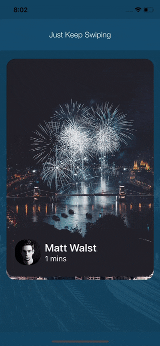

# Tinder Swipe View 

Inspired animation from Tinder and Potluck with undo feature

## Preview

<p align="center">
  
</p>


## Screenshot

<p align="center">
    
</p>

<p align="center">
  
  
</p>


## Instantiation

Tinder Swipe  can be added to storyboard or instantiated programmatically:

```swift
func createTinderCard(at index: Int , value :String) -> TinderCard {

        let card = TinderCard(frame: CGRect(x: 0, y: 0, width: viewTinderBackGround.frame.size.width , height:   viewTinderBackGround.frame.size.height - 50) ,value : value)
        card.delegate = self
        return card
}
```
## Animation

```swift

func rightClickAction(){
    let card = currentLoadedCardsArray.first
    card?.rightClickAction()
    }

func leftClickAction(){
    let card = currentLoadedCardsArray.first
    card?.leftClickAction()
    }

func makeUndoAction(){
    let card = currentLoadedCardsArray.first
    undoCard.makeUndoAction()
    }

func discardCard(){
    let card = currentLoadedCardsArray.first
    undoCard.makeUndoAction()
    }

func shakeCard(){
    let card = currentLoadedCardsArray.first
    card?.shakeCard()
    }

```

## Delegate Methods

Here is a list of callbacks you can listen to:

```swift
protocol TinderCardDelegate: NSObjectProtocol {
    func cardSwipedLeft(_ card: TinderCard)
    func cardSwipedRight(_ card: TinderCard)
    func updateCardView(_ card: TinderCard, withDistance distance: CGFloat)
}
```

## Requirements

```
* Swift 4.1
* XCode 9
* iOS 8.0 (Min SDK)
```

## Author

Nicky Patson

[HomePage](http://about.me/nickypatson)

<mail.nickypatson@gmail.com>


## License

Tinder Swipe View is available under the MIT license. See the LICENSE file for more info.

